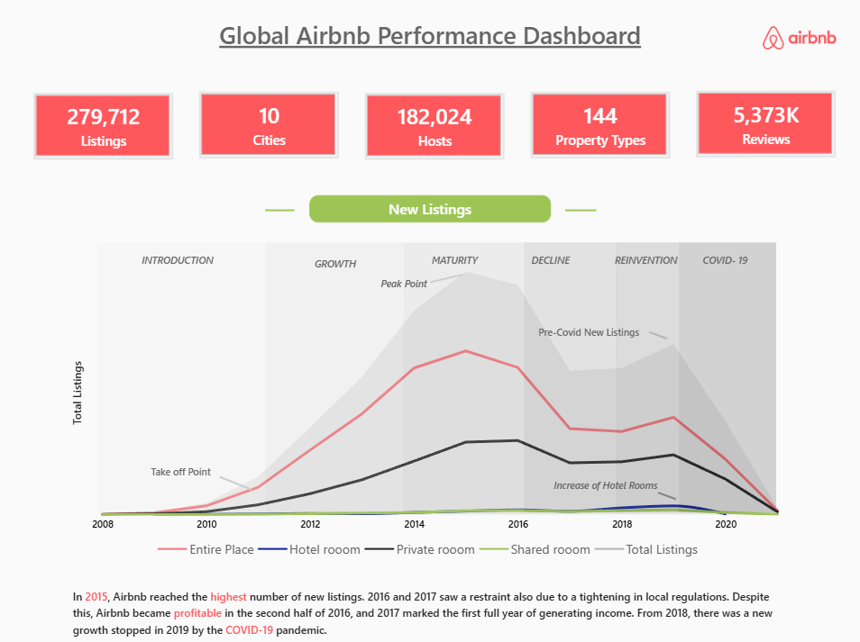
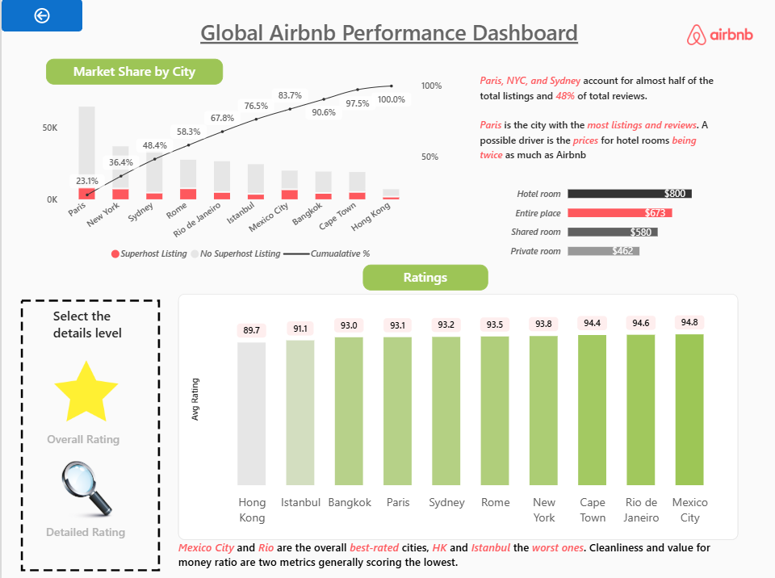
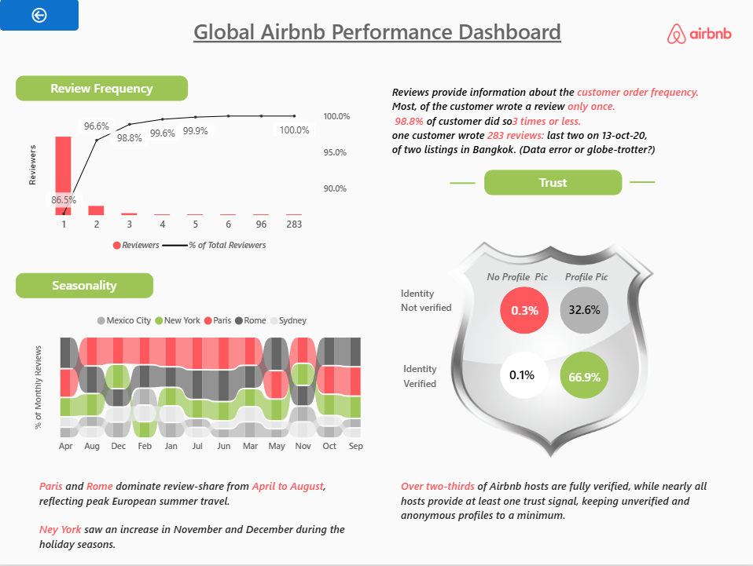

# 🌍 Global Airbnb Performance Dashboard

An interactive Power BI dashboard designed to analyze Airbnb listing performance, pricing, host performance, and customer feedback across locations.

The project focuses on practical business questions around **revenue, listings, pricing, hosts, amenities, reviews, and customer satisfaction**.

## 📊 Dashboard Analysis

### 1️⃣ General Overview
- What are the **Total Revenue, Total Listings, and Average Booking Price**?
- Which **locations, cities, or neighborhoods** generate the highest listings and revenue?
- Which **property/room types** contribute the most to bookings and earnings?

### 2️⃣ Performance & Pricing Analysis
- How does **average pricing** vary across locations and property types?
- How do amenities such as **Wi-Fi, Pool, and Parking** influence pricing and booking demand?
- How do **Superhosts compare with regular hosts** in response rate, response time, and availability?

### 3️⃣ Reviews & Customer Feedback Analysis
- What are the average guest ratings for **Accuracy, Cleanliness, Communication, and Value**?
- How have **reviews and customer feedback changed over time**?
- Which **hosts and regions** receive the highest and lowest customer satisfaction ratings?

## 🎯 Business Problem

Airbnb hosts and business teams need to understand how **location, property type, pricing, amenities, host performance, and customer experience** affect listing performance.

This dashboard brings these dimensions together to support market comparison, pricing analysis, host benchmarking, and customer-experience monitoring.

## 🎯 Dashboard Goals

- Monitor overall Airbnb performance through key metrics.
- Identify high-performing locations and property types.
- Compare pricing across markets and listing types.
- Understand the relationship between amenities and listing performance.
- Compare Superhost and regular-host performance.
- Track customer reviews and satisfaction over time.
- Identify areas and hosts with strong or weak customer feedback.

## 🔄 Project Workflow

**Airbnb Dataset → Data Preparation → Power BI Data Model → DAX Measures → Interactive Dashboard → Business Insights**

## 🛠️ Tools & Technologies

- **Power BI** – Dashboard development and interactive visualizations
- **Power Query** – Data preparation and transformation
- **DAX** – Measures and KPI calculations
- **Git & GitHub** – Version control and portfolio presentation

## 📸 Dashboard Preview

### General Overview

### Ratings Analysis

### Reviews Analysis

## 🔍 Key Analytical Areas

| Area | Analysis Focus |
|---|---|
| Revenue & Listings | Overall performance and market contribution |
| Geography | Locations, cities and neighborhoods |
| Property Types | Entire homes, private rooms and shared rooms |
| Pricing | Average price across markets and property types |
| Amenities | Impact of amenities on pricing and demand |
| Host Performance | Superhost vs regular-host comparison |
| Ratings | Accuracy, cleanliness, communication and value |
| Reviews | Customer feedback and trends over time |

## 💡 Business Impact

- **Market prioritization:** Identify locations with strong listing and revenue performance.
- **Pricing strategy:** Compare prices across locations and property types.
- **Property strategy:** Understand which room/property types perform better.
- **Amenity strategy:** Evaluate amenities associated with stronger pricing and demand.
- **Host management:** Benchmark Superhosts against regular hosts.
- **Customer experience:** Identify rating and review patterns for improvement.

## 📁 Project Files

- `AIRBNB DASHIBOARD.pbit` – Power BI dashboard template
- `Overview.png` – General overview screenshot
- `Ratings.png` – Ratings analysis screenshot
- `Reviews.png` – Reviews analysis screenshot
- `README.md` – Project documentation

> **Dataset note:** The original dataset is not included in this repository because of its large file size. The Power BI dashboard template and dashboard screenshots are included to demonstrate the completed analysis.

## 🚀 Skills Demonstrated

**Power BI • Power Query • DAX • Data Visualization • Business Analysis • KPI Development • Dashboard Design • Data Storytelling**

## 👨‍💻 Author

**Anas Khan**  
Data Analytics Portfolio Project